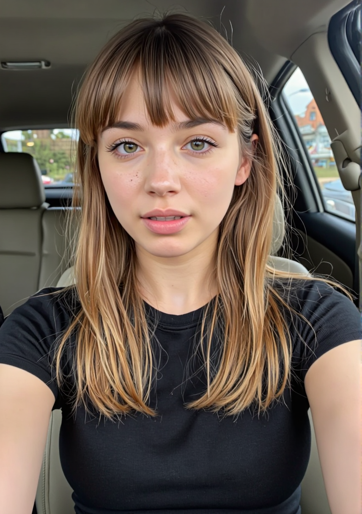
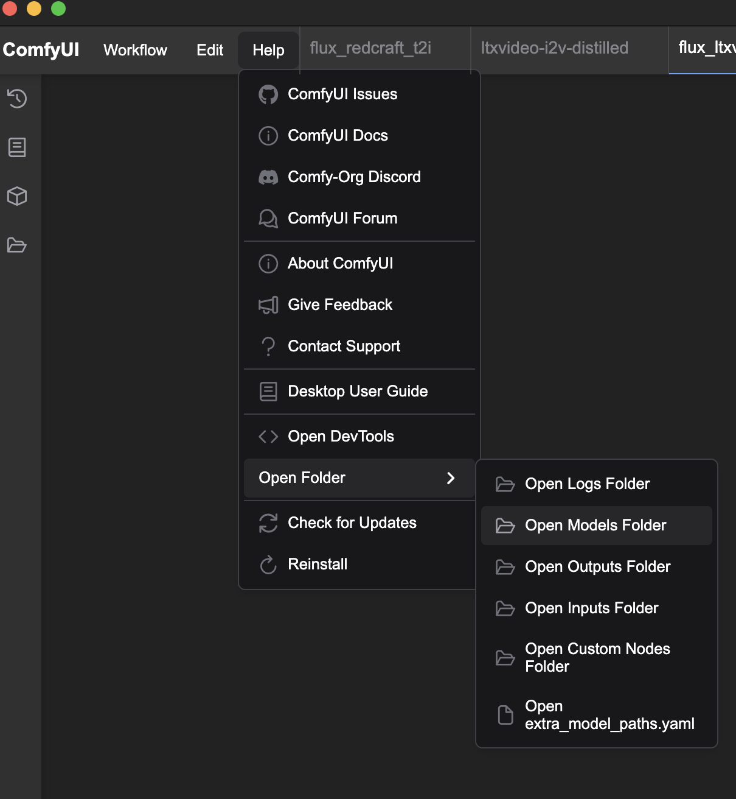
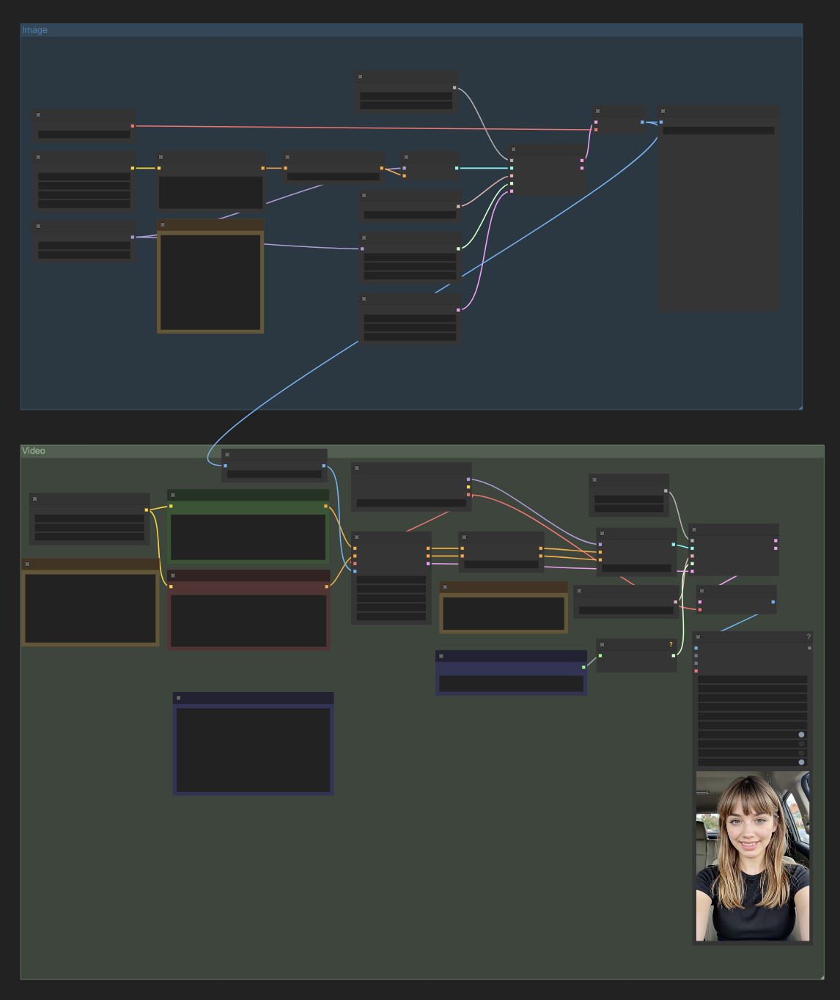
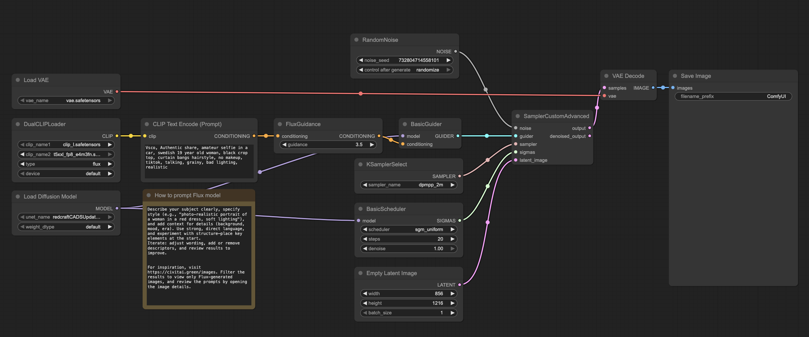
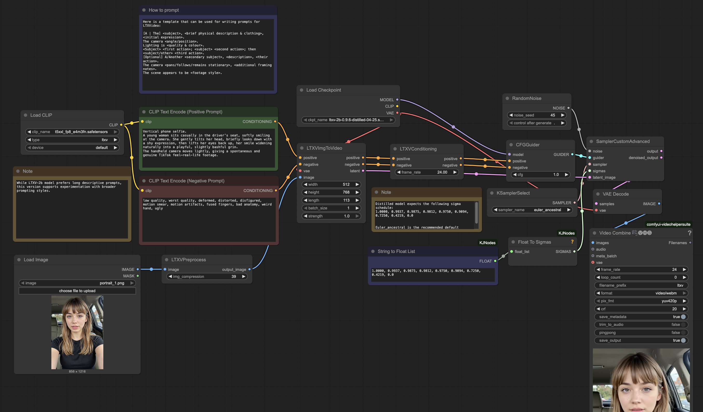

<!--more-->

## What You'll Create

Here's what you can make after following this guide:

**Example Input → Output:**

| Text Prompt | Generated Image |
|:------------|:--------------:|
| "Vsco, Authentic share, amateur selfie in a car, swedish 19 year old woman, black crop top, curtain bangs hairstyle, no makeup, tiktok, talking, grainy, bad lighting, realistic" |  |

| Motion Prompt | Final Video |
|:--------------|:-----------:|
| "Vertical phone selfie. A young woman sits casually in the driver's seat, softly smiling at the camera. She gently tilts her head, briefly looks down with a shy expression, then lifts her eyes back up, her smile widening naturally into a playful, slightly bashful grin. The handheld camera moves lightly, giving a spontaneous and genuine TikTok feel—real-life footage." | <video autoplay muted loop><source src="assets/ltxv_1.webm" type="video/webm"></video> |

> **Can your computer run this?**
> - Windows + NVIDIA GPU (8GB+ VRAM): ✓
> - Mac M1/M2/M3 (16GB+ RAM): ✓
> - Windows + AMD GPU: ✗
> - Mac Intel: ✗
>
> **Time needed:** ~45 minutes setup, then 5-10 minutes per video

## Quick Start Checklist

1. **Download ComfyUI Desktop**
   - Windows: [ComfyUI for Windows (NVIDIA)](https://comfy.org/download)
   - Mac: [ComfyUI for Mac (M1/M2/M3)](https://comfy.org/download)

2. **Download these models**
   - □ [Flux/RedCraft model](https://civitai.green/models/958009?modelVersionId=1576605) (~11GB)
   - □ [LTX Video model](https://huggingface.co/Lightricks/LTX-Video/blob/main/ltxv-2b-0.9.6-distilled-04-25.safetensors) (~6GB)
   - □ [T5 XXL text encoder](https://huggingface.co/comfyanonymous/flux_text_encoders/blob/main/t5xxl_fp8_e4m3fn.safetensors) (4.89 GB)
   - □ [CLIP text encoder](https://huggingface.co/comfyanonymous/flux_text_encoders/blob/main/clip_l.safetensors) (246 MB)
   - □ [VAE](https://huggingface.co/black-forest-labs/FLUX.1-schnell/blob/main/vae/diffusion_pytorch_model.safetensors) (168 MB)

3. **Put models in correct folders**
   - □ `models/unet/RedCraft_RealReveal5_ULTRA_15Steps_fp8_pruned.safetensors`
   - □ `models/checkpoints/ltxv-2b-0.9.6-distilled-04-25.safetensors`
   - □ `models/text_encoders/t5xxl_fp8_e4m3fn.safetensors`
   - □ `models/clip/clip_l.safetensors`
   - □ `models/vae/vae.safetensors` (rename from `diffusion_pytorch_model.safetensors`)

4. **Run the workflow**
   - □ Download [Workflow file](./workflows/flux_ltxvideo_t2v_full.json)
   - □ Open ComfyUI and load the workflow
   - □ Write your text prompt for the image
   - □ Write your motion prompt for the video
   - □ Click "Queue" and wait for your video

## What This Can (and Can't) Do

**This Workflow Can:**
- Create short videos (5-6 seconds) at 24 FPS
- Add subtle, realistic motion to still images
- Create camera movements like pans, tilts, and zooms
- Add environmental effects like wind in hair or leaves moving
- Generate videos faster than real-time on high-end hardware

**This Workflow Can't:**
- Create complex actions or movements
- Generate multiple scenes or scene transitions
- Make people run, dance, or perform complex activities
- Create Hollywood-quality special effects
- Produce videos with perfect frame-to-frame consistency

## Detailed Step-by-Step Instructions

### 1. Install ComfyUI Desktop

Download the appropriate version for your system:
- Windows: Use the [NVIDIA version](https://comfy.org/download)
- Mac: Use the [Apple Silicon version](https://comfy.org/download)

Run the installer and follow the prompts. When asked about GPU selection:
- On Windows: Choose "NVIDIA GPU"
- On Mac: Choose "MPS" (Metal Performance Shaders)

### 2. Download Required Models

You need five files for the complete workflow:

| Model | Purpose | Size | Download Link | Save To |
|-------|---------|------|--------------|---------|
| RedCraft RealReveal5 ULTRA | Image generation | ~11GB | [Download](https://civitai.green/models/958009?modelVersionId=1576605) | models/unet/ |
| LTX Video model | Video generation | ~6GB | [Download](https://huggingface.co/Lightricks/LTX-Video/blob/main/ltxv-2b-0.9.6-distilled-04-25.safetensors) | models/checkpoints/ |
| T5 XXL text encoder | Text understanding | 4.89 GB | [Download](https://huggingface.co/comfyanonymous/flux_text_encoders/blob/main/t5xxl_fp8_e4m3fn.safetensors) | models/text_encoders/ |
| CLIP text encoder | Text understanding | 246 MB | [Download](https://huggingface.co/comfyanonymous/flux_text_encoders/blob/main/clip_l.safetensors) | models/clip/ |
| VAE | Image encoding | 168 MB | [Download](https://huggingface.co/black-forest-labs/FLUX.1-schnell/blob/main/vae/diffusion_pytorch_model.safetensors) | models/vae/vae.safetensors |

To find your models folder:
1. Open ComfyUI
2. Click the three dots in the top-right corner
3. Select "Open Models Folder"



Create the necessary subfolders if they don't exist, and place each file in its correct location. For the VAE, rename `diffusion_pytorch_model.safetensors` to `vae.safetensors`.

### 3. Download and Run the Workflow

The easiest way to start is with a complete workflow that combines image and video generation:

1. Download the [combined workflow file](./workflows/flux_ltxvideo_t2v_full.json)

2. In ComfyUI, click "Load" and select the downloaded workflow file

3. If you see missing nodes errors:
   - Click "Manager" → "Install Missing Nodes"
   - Wait for installation to complete
   - Restart ComfyUI

4. Configure your prompts:
   - In the "Flux Prompt" node, enter your image description
   - In the "LTX Motion Prompt" node, describe the movement you want

5. Click "Queue" to run the workflow

6. Find your video in the `output` folder beside your ComfyUI models folder

### 4. Creating Effective Prompts

**For Image Generation (Flux):**
```text {open=true, lineNos=false, wrap=true, title="Flux prompt"}
Describe your subject clearly and specifically. Include details about:
- Who/what is in the image
- Style (realistic, cartoon, painting, etc.)
- Lighting and environment
- Clothing and appearance details
- Quality indicators (high quality, detailed, etc.)

Example: "Vsco, Authentic share, amateur selfie in a car, swedish 19 year old woman, black crop top, curtain bangs hairstyle, no makeup, tiktok, talking, grainy, bad lighting, realistic"
```

**For Video Generation (LTX):**
```text {open=true, lineNos=false, wrap=true, title="LTXVideo prompt"}
Describe the motion you want, including:
- Starting position/pose
- Any subject movements (subtle head turns, smiles, etc.)
- Camera movements (pans, zooms, etc.)
- Environmental effects (wind in hair, etc.)
- Overall feel (handheld, cinematic, etc.)

Example: "Vertical phone selfie. A young woman sits casually in the driver's seat, softly smiling at the camera. She gently tilts her head, briefly looks down with a shy expression, then lifts her eyes back up, her smile widening naturally into a playful, slightly bashful grin. The handheld camera moves lightly, giving a spontaneous and genuine TikTok feel—real-life footage."
```

## Troubleshooting Common Issues

### Model Not Found Errors

**Problem:** Red error text mentioning missing models or "Model not found"

**Solution:**
1. Check that your files are in the exact paths listed in Section 2
2. Ensure filenames match exactly (case-sensitive)
3. Restart ComfyUI after adding models
4. If using a workflow, make sure model selections match your filenames

### Out of Memory (OOM) Errors

**Problem:** "CUDA out of memory" or other memory errors

**Solution:**
1. Reduce image resolution (try 512x768 instead of higher)
2. Reduce video frames (65 frames = ~2.7 seconds at 24 FPS)
3. Close other applications
4. On Windows, use the `--lowvram` flag when starting ComfyUI
5. On Mac, be patient - the first run compiles optimizations

### Black or Blank Video Output

**Problem:** Generated video shows only black frames

**Solution:**
1. Check that the T5 text encoder is installed correctly
2. Make sure your motion prompt isn't empty
3. Try a simpler motion description
4. Generate a new image and try again

### Video Flickers or Shows Artifacts

**Problem:** The generated video shows flickering or motion inconsistencies

**Solution:**
1. Use simpler camera movements ("gentle pan" instead of complex movements)
2. Add "consistent lighting, consistent appearance" to your motion prompt
3. Reduce the CFG Scale value in the LTX node (try 5-7 instead of higher)
4. Generate a longer video and trim the first/last few frames

## Going Further: Advanced Techniques

Once you're comfortable with the basic workflow, try these improvements:

### Better Camera Movements

Start with simple camera movements that work well:
- "Camera slowly pans from left to right"
- "Gentle zoom in on the subject's face"
- "Slight handheld camera motion for realism"

Avoid complex movements like "camera circles around subject" which often cause artifacts.

### Subject Motion Guidelines

The most reliable subject motions are:
- Subtle facial expressions (smiles, blinks)
- Slight head turns
- Hair movement
- Environmental effects (leaves rustling, water rippling)

Avoid asking for walking, hand gestures, or complex body movements.

### Workflow Variations

For more flexibility, try these workflow variations:
1. [Image-only workflow](./workflows/flux_redcraft_t2i.json) - Just generate the image
2. [Video-from-existing-image workflow](./workflows/ltxvideo-i2v-distilled.json) - Use your own images

## How It Works (For The Curious)

If you're interested in the technical details, here's a simplified explanation:

### The Two-Stage Process

1. **Text → Image (Flux)**
   - Your text prompt is processed by text encoders (CLIP and T5)
   - The Flux model transforms random noise into an image matching your description
   - Each "step" refines the image from noise to a clear picture

2. **Image → Video (LTX-Video)**
   - Your motion prompt describes how things should move
   - LTX uses the initial image and creates new frames showing motion
   - The frames are combined into a smooth video

### Key Components

- **Text Encoders**: Convert your text into a format AI can understand
- **Diffusion Models**: Generate images by removing "noise" step by step
- **VAE**: Compresses images into a format the AI can work with
- **Samplers**: Control how accurately (but slowly) the AI follows your prompt

## Resources for Learning More

- [ComfyUI GitHub](https://github.com/comfyanonymous/ComfyUI) - Latest updates and documentation
- [Flux Models](https://civitai.green/models/958009) - More Flux models to try
- [LTX-Video GitHub](https://github.com/Lightricks/LTX-Video) - LTX documentation

---

## Appendix: Complete Folder Structure

For reference, here's the complete folder structure you should have:

```text {open=true, lineNos=false, wrap=true, title="Folder structure"}
models/
├── checkpoints/
│   └── ltxv-2b-0.9.6-distilled-04-25.safetensors
├── unet/
│   └── RedCraft_RealReveal5_ULTRA_15Steps_fp8_pruned.safetensors
├── text_encoders/
│   └── t5xxl_fp8_e4m3fn.safetensors
├── clip/
│   └── clip_l.safetensors
└── vae/
    └── vae.safetensors
```

Each of these files plays a specific role in the image→video generation process.

## Workflow Visual References

For clarity, here are the main workflow interfaces you'll interact with:

**Combined Text→Image→Video Workflow:**


**Image Generation Workflow:**


**Video Generation Workflow:**


Use these as visual references when setting up your workflow.
