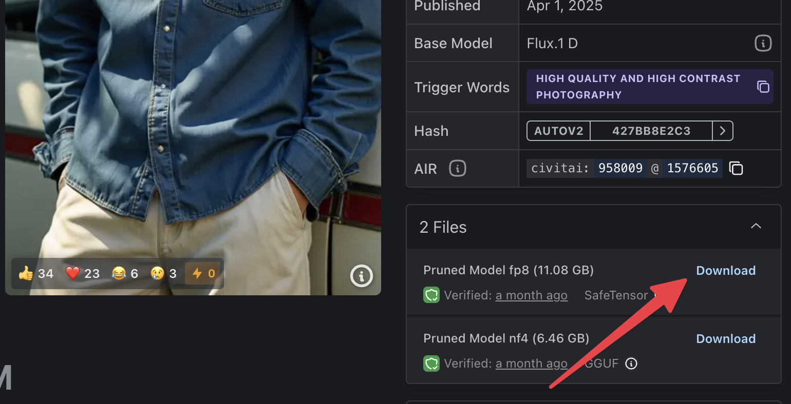
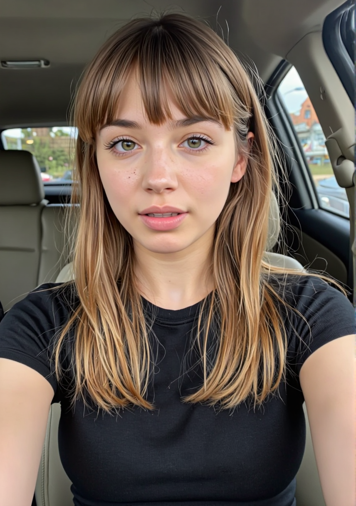

<!--more-->

*Turn text into living videos with AI. This guide shows you how to chain Flux (for images) and LTX-Video (for motion) in ComfyUI's visual programming interface.*

> 🎯 **Difficulty:** Like assembling IKEA furniture with instructions
>
> ⏱️ **Time Investment:** 1-2 hours setup, then 5-10 minutes per video
>
> 💻 **Hardware:** NVIDIA GPU (16GB+ VRAM) or M1/M2 Mac (16GB+ RAM)

## Intro

### The AI Video Pipeline Explained

1. **Text → Image (Flux)**
   - You describe a scene ("a cyberpunk detective smoking")
   - Flux generates a high-quality still image
   - *Think of this as writing a movie script for a single frame*

2. **Image → Video (LTX-Video)**
   - You describe motion ("slow zoom in, cigarette smoke rising")
   - LTX-Video animates the image over set number of frames
   - *This is where your still photo becomes a living scene*

### Core Concepts Made Simple

**Diffusion Models (How AI Creates)**
- Imagine starting with a blurry, static-filled TV screen
- The AI gradually clears up this static based on your description
- With each step, the picture becomes clearer until your image appears
- *It's like watching a Polaroid photo develop before your eyes*

**VAE (Variational Autoencoder)**
- Think of this as the translator between what you see (the image) and what the AI understands
- You don't need to worry about how it works - it happens automatically

**Text Encoders (Your Words to AI Language)**
- These turn your everyday English into special code the AI can understand
- Like having a personal interpreter who speaks both human and computer

**Samplers (Different Quality Settings)**
- Think of these as different quality modes on your camera
- "Quick mode" = faster but rougher results
- "Detailed mode" = slower but prettier results
- You'll mostly use the default, which is a good balance

**VRAM (Video Memory)**
- Model weights need to be loaded into VRAM to be used
- Bigger models require more VRAM
- 12GB VRAM is the minimum for most models
- 24GB VRAM is recommended for better performance

**Nodes - ComfyUI's Building Blocks**
- Each node does one specific job
- Connect them like LEGO to build workflows
- *Example pipeline:*
  1. `Text Prompt` → `Flux Sampler` → `Image`
  2. `Image + Motion Prompt` → `LTX Sampler` → `Video`

*Pro Tip:* FP16 gives better quality but needs more VRAM. FP8 is more efficient for testing ideas.

### The Full Assembly Line

1. **Load Models** (Flux + LTX)
2. **Text Prompt** → Flux generates image
3. **Image + Motion Prompt** → LTX generates video frames
4. **Save Video** (stitches frames together)

---

## Quick Start Guide

For those who want to jump right in, here's the TL;DR version:

1. **Install ComfyUI Desktop** (15-20 min)
   - Windows: Download and install ComfyUI Desktop from [comfy.org](https://comfy.org/download) (NVIDIA GPU required)
   - Mac: Download and install ComfyUI Desktop from [comfy.org](https://comfy.org/download) (Apple Silicon only)
   - Advanced users can alternatively use `pip install comfy-cli` for CLI installation

2. **Download Required Models** (20-30 min)
   - **Flux/RedCraft model** (~11GB)
     - 
     - Download: [RedCraft RealReveal5 ULTRA (FP8, pruned)](https://civitai.green/models/958009?modelVersionId=1576605)
     - Save to: `models/unet/RedCraft_RealReveal5_ULTRA_15Steps_fp8_pruned.safetensors`
   - **LTX Video model** (~6GB)
     - Download: [ltxv-2b-0.9.6-distilled-04-25.safetensors](https://huggingface.co/Lightricks/LTX-Video/blob/main/ltxv-2b-0.9.6-distilled-04-25.safetensors)
     - Save to: `models/checkpoints/ltxv-2b-0.9.6-distilled-04-25.safetensors`
   - **T5 XXL text encoder** (4.89 GB)
     - Download: [t5xxl_fp8_e4m3fn.safetensors](https://huggingface.co/comfyanonymous/flux_text_encoders/blob/main/t5xxl_fp8_e4m3fn.safetensors)
     - Save to: `models/text_encoders/t5xxl_fp8_e4m3fn.safetensors`
   - **CLIP text encoder** (246 MB)
     - Download: [clip_l.safetensors](https://huggingface.co/comfyanonymous/flux_text_encoders/blob/main/clip_l.safetensors)
     - Save to: `models/clip/clip_l.safetensors`
   - **VAE** (168 MB)
     - Download: [diffusion_pytorch_model.safetensors](https://huggingface.co/black-forest-labs/FLUX.1-schnell/blob/main/vae/diffusion_pytorch_model.safetensors)
     - Save to: `models/vae/vae.safetensors` (rename `diffusion_pytorch_model.safetensors` to `vae.safetensors`)

3. **Run workflow** (2-10 minutes)
   - Open [Workflow file](./workflows/flux_ltxvideo_t2v_full.json)
   - Make sure correct models are selected in the nodes
   - Write descriptive prompt for first frame
   - Write motion prompt for the rest of the video
   - Run workflow

> 💡 **Pro Tip:** Start with simple camera movements like gentle pans or zooms for best results.

For detailed instructions and troubleshooting, continue reading below.

---

## What is ComfyUI, Flux, and LTX Video?

**ComfyUI** is a powerful, node-based graphical interface for image generation. Instead of writing code, you visually connect **blocks (nodes)** to build an AI pipeline. For example, one node loads an AI model, another takes your text prompt, another generates an image, etc. You chain these nodes to create workflows for images or even videos. It's like building a flowchart that produces art!

**Flux** is a family of high-quality text-to-image diffusion models developed by Black Forest Labs. As of early 2025, Flux models are considered some of the best image generation models. In simple terms, Flux is the AI "brain" we'll use to generate a stunning portrait from your text prompt. We will use a custom version of Flux model called *RedCraft RealReveal5 ULTRA* that is optimized for portraits.

**LTX Video** is an open-source video generation model developed by Lightricks. It takes an image (or text) and generates a short video clip by imagining motion. LTX is optimized for speed – for instance, version 0.9.5 could render a 4-second video in ~17 seconds on an RTX 4090. We will use 0.9.6-distilled version of LTX Video model which is even faster. It's not magic movie maker – think of it as adding subtle motion (camera movements, slight subject movements, etc.) to a still image.

**How they fit together:** First, **Flux** generates a vertical portrait image from a prompt (e.g. a person or scene you describe). Then **LTX Video** takes that image and a "motion prompt" (describing how the camera or subject should move) to produce a series of frames – in other words, a short video. ComfyUI is the glue that lets us run Flux and LTX in one workflow: the output of the image generation nodes will feed into the video generation nodes. Essentially, **text → image → video** all within ComfyUI, using Flux and LTX under the hood.

## How Does Text Become a Video?

At a high level, the process works in two stages:

| Stage | Example Output |
|:------|:--------------:|
| **Stage 1: Text-to-Image (Flux)** - You write a text prompt describing the portrait or scene you want. ComfyUI feeds this prompt into the Flux model, which diffuses random noise into an image that matches your description. This is done via a neural network that has learned to generate images from text. The result is a single AI-generated **portrait image** (we'll make it vertical format for TikTok). |  |
| **Stage 2: Image-to-Video (LTX)** - Take the image from Stage 1 and feed it, along with a **motion prompt**, into the LTX Video model. LTX generates additional frames as if the scene is moving or the camera is moving by diffusing noise into new images while maintaining consistency with the original. | <video controls><source src="assets/ltxv_1.webm" type="video/webm"></video> |

ComfyUI links these stages, so after Stage 1 finishes, Stage 2 can use the output automatically. The end result is a short video (several seconds long) where the initial AI image comes to life. You might see the camera zoom or pan, the subject's expression change slightly, or environmental movement, depending on your motion prompt. It's like those Harry Potter photos – still images that move a bit!

## What to Expect (and What *Not* to Expect)

Before we get into the nuts and bolts, let's set realistic expectations:

- **Video Length & Quality:** The model generates high-quality videos at **24 FPS** with support for up to **129 frames** (about 5.4 seconds). The idea is to produce cinematic sequences with smooth, natural motion. Quality can be surprisingly good for camera movements and subtle animations. For example, a gentle pan or the subject's expression changing can look very natural. However, complex movements (like running, or multiple subjects interacting) will **not** look realistic – the model isn't that advanced yet.

- **Speed:** The latest LTX Video model (0.9.6-distilled) is highly optimized and can generate videos faster than real-time playback at 24 FPS on high-end GPUs. On a high-end GPU (e.g. Nvidia RTX 3080/4090), you can expect generation times of 15-30 seconds for a typical video. On lower-end hardware (or Apple M1/M2), it will be slower (possibly a few minutes total), but still much faster than traditional video rendering or earlier AI video models. The distilled model achieves this speed by using only 8 diffusion steps per frame while maintaining quality.

- **Realism Limits:** The output video is essentially a series of AI-generated images, so you might see minor flicker or differences frame to frame (the model works to keep them consistent, but it's not perfect). The motions will be subtle. For instance, you can create a slow camera pan, slight subject movements (like a head turn or smile), or environmental effects (like leaves trembling). It excels at **small, smooth changes**. If you try something extreme (like "she starts dancing wildly"), the result will likely be strange or glitchy. **Don't expect** the kind of coherence you'd get from a real video camera – think of it more like a moving painting.

- **Resolution:** The model works on resolutions that are divisible by 32 and number of frames that are divisible by 8 + 1 (e.g. 257). In case the resolution or number of frames are not divisible by 32 or 8 + 1, the input will be padded with -1 and then cropped to the desired resolution and number of frames. The model works best on resolutions under 720 x 1280 and number of frames below 257. For optimal performance, **768×512** resolution is recommended, where it can generate videos faster than real-time playback.

- **One scene only:** LTX does not *create new content per frame*; it transforms the given image. So if your image is a person standing, the video will be that same person – they won't suddenly change clothes or location (unless your motion prompt somehow forces a change, but that often just yields artifacts). It's essentially **the same scene with slight motion**. This is great for cinematic camera moves or a bit of life in a portrait, but not for storyboarding multi-scene sequences.

In short, **expect** a short, artsy moving image with mild motion. **Don't expect** a full dynamic action sequence or a perfectly stable video on the first try. Part of the fun is experimenting and seeing what the AI can do within these limits!

## Requirements: Hardware and Software

Let's make sure you have the right setup before we proceed.

**Operating System:** You can do this on **Windows or macOS**. (Linux works too, but this guide focuses on Win/Mac.) On Windows, you'll need an **NVIDIA GPU** for GPU acceleration. On macOS, you'll need an **Apple Silicon** Mac (M1, M2, M3 chips) – the Desktop version of ComfyUI doesn't support Intel Macs, and Apple Silicon provides the needed ML acceleration (Metal Performance Shaders).

**GPU and VRAM:** For Windows/NVIDIA users, a GPU with at least **8 GB VRAM** is recommended. 12GB+ will allow higher resolution (up to 720×1280) and more frames. (Flux and LTX are heavy models; Flux's all-in-one FP8 model is ~11 GB on disk and typically wants ~16 GB VRAM to run comfortably, but it can work on 8–12 GB with optimizations or lower resolution.) The LTX 0.9.6-distilled model is optimized for efficiency, requiring only 8 diffusion steps per frame. For macOS M1/M2 users, at least **16 GB unified memory** is recommended (32 GB is better). Macs use the GPU integrated in the chip – it can run these models, but slower. Be prepared for longer generation times on Mac compared to a high-end PC GPU. If you have no dedicated GPU (and only a CPU), it's technically possible to run ComfyUI, but it will be **extremely slow** (minutes per frame); this guide assumes you have some GPU capability.

**RAM and Disk:** Ensure you have sufficient disk space – the models are large (the Flux model ~11 GB, LTX model ~ >2 GB, plus another ~10 GB for a text encoder file). RAM isn't usually a bottleneck beyond what's needed to load models into VRAM, but having 16 GB+ system RAM is a good idea.

**Software:** We will use **ComfyUI Desktop** (the easy installer version). ComfyUI will handle all the heavy lifting (no need to install Python environments manually unless you want to). We'll also use ComfyUI's built-in **Manager** to install the needed **custom nodes** (the LTX extension, etc.). No coding required – just some downloads and clicking.

**Summary:**

- **Windows + NVIDIA GPU** (8GB+ VRAM, Windows 10/11) – Supported (ComfyUI Desktop for Windows) ([Download ComfyUI for Windows/Mac](https://www.comfy.org/download#:~:text=For%20Mac%3A%20Requires%20Apple%20Silicon)).
- **macOS + Apple Silicon (M1/M2)** (16GB+ recommended) – Supported (ComfyUI Desktop for Mac) ([Download ComfyUI for Windows/Mac](https://www.comfy.org/download#:~:text=For%20Mac%3A%20Requires%20Apple%20Silicon)).
- **macOS Intel or Windows with AMD GPU** – *Not directly supported by ComfyUI Desktop.* You would need to use the ComfyUI source/CLI with relevant hacks (beyond this guide). It's possible via PlaidML or CPU, but not beginner-friendly.
- **Storage** – ~35 GB free for models/files.
- **Internet** – needed to download models and ComfyUI, but generation itself runs locally.

Now that we have what we need, let's get everything set up.

## Installation: ComfyUI Desktop

ComfyUI Desktop is the easiest way to get up and running. It packages ComfyUI with a one-click installer and manages all the Python dependencies for you. No need to use the command line (unless you want to).

> ⚠️ **System Requirements Check**
> Before proceeding, verify you have:
> - Windows: NVIDIA GPU with 8GB+ VRAM, Windows 10/11
> - Mac: M1/M2/M3 chip, 16GB+ unified memory
> - ~35GB free disk space for models
> - Stable internet connection for downloads

### 🪟 Windows Installation (15-20 minutes)

1. **Download ComfyUI Desktop:** Go to the official [ComfyUI download page](https://comfy.org/download) and click **"Download for Windows (NVIDIA)"**. The Windows version requires an NVIDIA graphics card for CUDA support.

2. **Run the Installer:** Double-click the downloaded installation package. The installer will:
   - Create a ComfyUI Desktop shortcut on your desktop
   - Set up the required environment
   - Install dependencies (including PyTorch, which is several GB)

3. **First Launch & Setup:**
   - Double-click the ComfyUI Desktop shortcut
   - On first run, you'll see an initialization screen
   - Select "NVIDIA GPU (Recommended)" when prompted
   - Choose an installation location (preferably on an SSD with at least 15GB free space)
   - Optionally import settings from an existing ComfyUI installation
   - Configure preferences (updates, analytics, etc.)
   - Wait for the initialization to complete

4. **Verify Installation:**
   - The ComfyUI interface should open automatically
   - You'll see a blank canvas with a toolbar (Manager, Load, Save, Queue buttons)
   - Check the console for "Using device cuda" to confirm GPU detection

> 🔧 **Pro Tip:** Windows Defender might warn about Python components - this is normal as ComfyUI is a Python application. The software is open source and safe.

### 🍎 macOS Installation (15-20 minutes)

1. **Download ComfyUI Desktop:** On the [ComfyUI download page](https://comfy.org/download), click **"Download for MacOS"**. The app requires Apple Silicon (M1/M2/M3) - Intel Macs are not supported.

2. **Install the App:**
   - Open the downloaded .dmg file
   - Drag ComfyUI into your Applications folder
   - If you see a prohibition sign on the icon, your system may not be compatible

3. **First Launch & Setup:**
   - Find ComfyUI in Launchpad and click to open
   - Right-click and choose "Open" if you see a Gatekeeper warning
   - On the initialization screen, select "MPS (Recommended)" for GPU acceleration
   - Choose an installation location (ensure ~5GB free space)
   - Optionally import existing ComfyUI settings
   - Configure preferences (updates, analytics, etc.)
   - Wait for initialization to complete (includes downloading ~15GB of dependencies)

4. **Verify Installation:**
   - The ComfyUI interface should open automatically
   - You'll see the node editor interface
   - The app uses Metal Performance Shaders (MPS) for acceleration

> 🚨 **M1/M2/M3 Mac Note:** First run is slower due to PyTorch optimization compilation. Performance improves in subsequent runs.

### ⌨️ Optional: ComfyUI via CLI (Advanced Users)

If you're comfortable with the terminal or need features not available in the Desktop app (like AMD GPU support), you can use the CLI installation method:

1. **Install ComfyUI CLI:**
```bash
pip install comfy-cli
```

2. **Create and activate a Python environment:**
```bash
# Using conda
conda create -n comfy-env python=3.11
conda activate comfy-env

# Or using venv
python -m venv comfy-env
source comfy-env/bin/activate  # On Unix/Mac
comfy-env\Scripts\activate     # On Windows
```

3. **Install ComfyUI:**
```bash
comfy install
```

4. **Launch ComfyUI:**
```bash
comfy launch
```

The CLI version offers more flexibility and control, but requires more technical knowledge. For most users, **ComfyUI Desktop** is recommended as it handles updates and environment management automatically. Now, let's proceed to downloading the required AI models.

---

## Downloading the Models (Flux, LTX Video, Text Encoders, and VAE)

Follow these straightforward steps to download all necessary models and place them in the correct locations within ComfyUI's folder structure. First, open your **Models Folder** within ComfyUI:


You will place all downloaded files in subfolders within this models folder.

### 1. Flux Model (RedCraft RealReveal5 ULTRA)

* **Download**: [RedCraft RealReveal5 ULTRA (FP8, pruned)](https://civitai.green/models/958009?modelVersionId=1576605) (\~11GB)
- 
* **Save to**:

```
models/unet/RedCraft_RealReveal5_ULTRA_15Steps_fp8_pruned.safetensors
```

### 2. LTX Video Model

* **Download**: [ltxv-2b-0.9.6-distilled-04-25.safetensors](https://huggingface.co/Lightricks/LTX-Video/blob/main/ltxv-2b-0.9.6-distilled-04-25.safetensors) (\~6GB)
* **Save to**:

```
models/checkpoints/ltxv-2b-0.9.6-distilled-04-25.safetensors
```

### 3. T5 XXL Text Encoder

* **Download**: [t5xxl\_fp8\_e4m3fn.safetensors](https://huggingface.co/comfyanonymous/flux_text_encoders/blob/main/t5xxl_fp8_e4m3fn.safetensors) (\~4.89 GB)
* **Save to**:

```
models/text_encoders/t5xxl_fp8_e4m3fn.safetensors
```

### 4. CLIP Text Encoder

* **Download**: [clip\_l.safetensors](https://huggingface.co/comfyanonymous/flux_text_encoders/blob/main/clip_l.safetensors) (\~246 MB)
* **Save to**:

```
models/clip/clip_l.safetensors
```

### 5. VAE

* **Download**: [diffusion\_pytorch\_model.safetensors](https://huggingface.co/black-forest-labs/FLUX.1-schnell/blob/main/vae/diffusion_pytorch_model.safetensors) (\~168 MB)
* Rename downloaded file to `vae.safetensors`
* **Save to**:

```
models/vae/vae.safetensors
```

---

Now, your `models` folder structure should look like this:

```
models/
├── checkpoints/
│   └── ltxv-2b-0.9.6-distilled-04-25.safetensors
├── unet/
│   └── RedCraft_RealReveal5_ULTRA_15Steps_fp8_pruned.safetensors
├── text_encoders/
│   └── t5xxl_fp8_e4m3fn.safetensors
├── clip/
│   └── clip_l.safetensors
└── vae/
    └── vae.safetensors
```

After placing all files correctly, restart ComfyUI to ensure models are loaded properly.

## Step-by-Step Workflow in ComfyUI

Follow these practical steps to generate your AI-powered videos smoothly. Ensure all your downloaded models are correctly placed as outlined earlier.

### 🖼️ **Step 1: Generate an Image with Flux**


1. **Download the Image Workflow**:
   - Get the workflow file [`flux_redcraft_t2i.json`](./workflows/flux_redcraft_t2i.json).

2. **Open the Workflow in ComfyUI**:
   - Launch ComfyUI Desktop.
   - Click on **"Workflow" → "Open"** and select the downloaded `flux_redcraft_t2i.json`.

3. **Run**:
   - Press the **Queue** button to run the workflow.

4. **Check Results**:
   - Generated images will appear in the `output` folder within your ComfyUI directory (next to your `models` folder).

### 🎬 **Step 2: Create Video from Your Image with LTX Video**


1. **Download the Video Workflow**:
   - Download [`ltxvideo-i2v-distilled.json`](./workflows/ltxvideo-i2v-distilled.json).

2. **Open the Workflow in ComfyUI**:
   - Again, select **"Workflow" → "Open"** and pick the downloaded file.

3. **Install Missing Nodes (If Required)**:
   - Upon opening, if you encounter errors about missing nodes:
     - Click **"Manager" → "Install Missing Nodes"** from the top menu.
     - Install all listed extensions. Wait for completion and restart ComfyUI.

4. **Select Your Starting Frame**:
   - Connect your previously generated image from the Flux workflow:
     - Use the **Image Loader** node and select your generated image (`output/your_image.png`).

5. **Run and Check Your Video**:
   - Click **Queue** to execute.
   - Your video frames or final video will appear in the `output` directory.

### 🚀 **Step 3: Full End-to-End Workflow (Text → Image → Video)**


For maximum efficiency, use the integrated workflow that automates image generation and video creation:

1. **Download Integrated Workflow**:
   - Grab [`flux_ltxvideo_t2v_full.json`](./workflows/flux_ltxvideo_t2v_full.json).

2. **Load and Verify**:
   - Open this workflow in ComfyUI.
   - Ensure all model paths match exactly as above (Flux and LTX models).

3. **Enter Prompts**:
   - Enter your descriptive **text prompt** (for the image) and **motion prompt** (for the video).

4. **Generate Your Complete AI Video**:
   - Hit **Queue** and watch your workflow run:
     - Flux generates your initial frame.
     - LTX Video transforms it into a stunning moving sequence.

5. **Enjoy and Share!**:
   - Your fully-generated video will appear automatically in the `output` folder.
   - Experiment with prompts, styles, and motions to get unique results!

### 🎯 **Pro Tips for Smoother Workflows**:

- Always double-check file paths if you encounter errors.
- After installing nodes or adding models, restart ComfyUI for best results.
- Keep your initial experiments simple (e.g., gentle camera pans) to ensure optimal performance and quality.
- Experiment and iterate frequently—each attempt helps you master the AI video generation process!

### Advanced Techniques

Once you're comfortable with the basic workflow, try these advanced techniques to improve your results:

1. **Advanced Node Configurations:**
   - Use the STGGuiderAdvanced node for better motion control
   - Implement frame interpolation for smoother transitions
   - Add ControlNet nodes for precise motion guidance
   - Experiment with custom VAE configurations

2. **Multi-Stage Processing:**
   - Generate intermediate frames for complex movements
   - Use frame blending for smoother transitions
   - Implement motion vector guidance
   - Add post-processing effects (color grading, stabilization)

3. **Performance Optimization:**
   - Use model merging techniques
   - Implement efficient batching strategies
   - Optimize VRAM usage with advanced scheduling
   - Fine-tune parameters for speed vs. quality

4. **Quality Improvements:**
   - Use advanced prompt engineering techniques
   - Implement temporal consistency checks
   - Add motion refinement passes
   - Use advanced upscaling techniques

Now you can iterate to produce different videos using any of these three levels, depending on your needs and expertise.

## 🔧 Troubleshooting FAQ

> 🚨 **Common Error Quick Reference**
> - Model not found → Check paths in `models/` folder
> - Red nodes → Install missing extensions via Manager
> - Black frames → Verify T5 encoder is installed
> - OOM errors → Reduce resolution or batch size
> - Crashes → Monitor VRAM usage, reduce load

### 🛑 Error Messages and Solutions

**Q: I hit "Queue" but got an error / red error box.**
A: Read the error message carefully. Common issues:
- *Missing model file:* Did you place the model files in the correct folders? If the Checkpoint Loader can't find the model, double-check the filenames and paths. By default, `models/checkpoints` and `models/text_encoders` are loaded. If you named something incorrectly (e.g., forgot ".safetensors"), fix that.
- *Missing custom node:* If you see something like "No such node: LTX*" or "VideoCombine not found", you need to install the extension nodes. Go to **Manager > Custom Nodes** and install the LTX Video extension and any video helper nodes. After installing, restart ComfyUI and try again.
- *Load errors on Mac (MPS issues):* Sometimes you might see messages about MPS or data types. Ensure you're on the latest ComfyUI and that the pruned FP8 model is supported on Mac. As of writing, pruned FP8 models now work on MPS with updated PyTorch. If not, you might try using the full FP16 model version, but that might require more VRAM than the Mac has, leading to needing CPU. If nothing works, you may have to run in CPU mode (very slow) or use a cloud GPU.

### 💾 Memory Management

**Q: The image generation (Flux) is running out of memory (OOM error).**

A: Flux models are memory-intensive. Here's how to handle OOM issues:

1. **Model Optimization**
   - Use FP8 pruned model
   - Try Flux Schnell for lower VRAM usage
   - Consider NF4 quantized version for 6GB cards

2. **Resolution Management**
   - Start with lower resolution
   - Upscale results after generation if needed

3. **System Optimization**
   - Close background applications
   - Use `--lowvram` or `--medvram` flags
   - Monitor VRAM usage with task manager

4. **Alternative Solutions**
   - Try Flux Schnell (4-step distilled model)
   - Use NF4 quantized version for 6GB cards
   - Consider cloud solutions for heavy workloads

### 🎬 Video Generation Issues

**Q: My video output is black / blank frames.**
A: If the output video is just black frames, a few potential causes:
- The text prompt might not have been applied. Make sure the motion Text Encode is properly connected to the LTX node. If it wasn't, the model might not know what to do and output nothing meaningful (though pure black is unusual – usually you'd get noise or something).
- The **t5 text encoder model** wasn't loaded. Black frames can happen if the model didn't get any conditioning. Did you download and place `t5xxl_fp8_e4m3fn.safetensors` in `models/text_encoders`? Without it, the LTX model might not have a text encoder to use. Check the console log when you run LTX – if it says "T5 encoder not found", that's the issue. Put the file in the right place and restart.
- If using negative prompts with certain custom schedulers, sometimes a bug could cause odd outputs. Try a run without negative prompt to isolate the issue.
- It could also be an issue of the initial frame not being fed correctly. If the initial latent is not connected, the model might be generating from pure noise and if something fails, could yield black. Ensure the VAE Encode of the image is actually providing an output. You might test the VAE Encode + VAE Decode on the image alone to verify it reconstructs the input image (should output basically the same image).

**Q: The video has jarring flicker / the subject changes appearance mid-way.**
A: This is a common challenge in AI video. Some tips:
- Use a stronger prompt emphasis on consistency. E.g., add phrases like "the person's face remains the same throughout" or "maintains consistent appearance".
- If flicker is in background details, maybe simplify the background description so it's less likely to introduce random elements.
- Decrease CFG scale for the video model. High CFG can cause the model to "fight itself" each frame, sometimes causing oscillation. Try CFG 5 or 6 instead of 7 or 8.
- If the model supports **frame interpolation or sequence conditioning** (the LTX 0.9.5 added some features), you could explore those advanced nodes. For example, feeding the last frame back in to guide the next (but that's likely happening internally already).
- Another trick: generate a slightly longer video and then drop the first or last few frames which might be more unstable. Sometimes the very start or end frame can be off.
- Ensure you're using the distilled model correctly. If you inadvertently used the full model with only 8 steps, it might be under-processing leading to flicker. The full model needs more steps; the distilled one is okay with 8. Match the model to the step count.

**Q: ComfyUI crashes or closes suddenly.**
A: If it just disappears, it might be running out of system RAM or hitting some fatal error. Check if there's a crash log or run ComfyUI from a terminal to see messages. On Windows, you might see a "Python has stopped working". This could be memory (check if your RAM usage was maxed) or a bug. Try reducing load as above, and ensure you're using the latest ComfyUI version, as many bugs are fixed in updates. Also, running too high resolution video frames can crash some video encoding nodes due to memory – try smaller.

**Q: The final video file won't play or is not created.**
A: If using Video Combine, ensure you gave it a proper file path ending in `.mp4` or `.gif`. Some older versions default to `.webm` or raw. Use `.mp4` for broad compatibility. Also check the console for ffmpeg errors (VideoCombine uses ffmpeg in the back). If it didn't save, maybe the node didn't execute. You might have to connect a dummy output (like an Image Viewer) to force execution, depending on node implementation. If all else fails, save frames and compile externally.

**Q: How can I loop the video seamlessly?**
A: Seamless loops are tricky. One idea: make the last frame similar to the first. LTX 0.9.5 introduced a way to condition the last frame. If you had a way to feed the first frame as also a "target" for the last, you could morph back. Without that, you can try a subtle approach: not too much change overall, so looping isn't too jarring. Sometimes reversing the video and concatenating can create a boomerang effect that loops. This is more of a creative editing trick afterwards.

## Tips for Better Results and Experimentation

- **Craft Detailed Video Prompts:** LTX works best with long, descriptive prompts that include:
  1. **Subject Description:** Clearly describe who/what is in the scene (e.g., "A woman with long brown hair and light skin, wearing a black jacket")
  2. **Scene Context:** Include setting and lighting details (e.g., "warm and natural lighting, likely from the setting sun")
  3. **Camera Movement:** Specify how the camera behaves (e.g., "camera slowly dollying forward", "camera remains stationary")
  4. **Motion Details:** Describe any movement in the scene (e.g., "her hair swaying gently", "waves crashing against rocks")
  5. **Atmosphere:** Add mood and quality indicators (e.g., "the scene appears to be real-life footage", "the lighting is dim, casting soft shadows")

For prompting Flux model follow this:

```
Describe your subject clearly, specify style (e.g., "photo-realistic portrait of a woman in a red dress, soft lighting"), and add context for details (background, mood, era). Use strong, direct language, and experiment with structure—place key elements at the start.

For inspiration, visit https://civitai.green/images. Filter the results to view only Flux-generated images, and review the prompts by opening the image details.
```

Here is a template that can be used for writing prompts for LTXVideo:

```
[A | The] <subject>, <brief physical description & clothing>, <initial expression>.
The camera <angle/position>.
Lighting is <quality & colour>.
<Subject> <first action>; <subject> <second action>; then <subject/other> <third action>.
[Optional] A/Another <secondary subject>, <description>, <their action>.
The camera <pans/follows/remains stationary>, <additional framing notes>.
The scene appears to be <footage style>.
```

Real examples from LTX documentation:
- *"The camera pans across a cityscape of tall buildings with a circular building in the center. The camera moves from left to right, showing the tops of the buildings and the circular building in the center. The buildings are various shades of gray and white, and the circular building has a green roof. The camera angle is high, looking down at the city. The lighting is bright, with the sun shining from the upper left, casting shadows from the buildings. The scene is computer-generated imagery."*
- *"A woman with long brown hair and light skin smiles at another woman with long blonde hair. The woman with brown hair wears a black jacket and has a small, barely noticeable mole on her right cheek. The camera angle is a close-up, focused on the woman with brown hair's face. The lighting is warm and natural, likely from the setting sun, casting a soft glow on the scene. The scene appears to be real-life footage."*

- **Use Seeds to Your Advantage:** If you find a seed that gives a great image, note it down. Similarly, LTX might allow a seed for noise in the motion (some workflows allow setting a "video seed"). Consistent seeds can reproduce results or allow you to vary one thing at a time. If you want different outcomes, randomize seeds. If you want the *same* general motion on a slightly different image (or vice versa), keep one seed constant and change the other.

- **Leverage Negative Prompts:** Don't forget negative prompts in both stages. They can be powerful in removing unwanted artifacts. Common negatives for portraits: *"blurry, duplicate face, text, watermark, deformed, extra finger, mutated"*. For video: *"flicker, jump cut, glitch, distortion"* might help (no guarantee the model understands all those, but it might).

- **Play with Schedules and Advanced Nodes:** Once you get comfortable, you can explore advanced ComfyUI nodes like **STG (Sigma Threshold Gradient) or CFG schedules**. The LTX extension mentioned an "STGGuiderAdvanced" which can vary CFG over diffusion steps. These are more technical, but can improve quality if tuned. For example, high CFG in early steps and lower in later steps might reduce flicker.

- **Resolution Upscaling:** If you got a great result at low res, you can try to upscale the final video frames. You could use an AI upscaler frame by frame (like ESRGAN or CodeFormer via ComfyUI nodes, or an external tool). There's no built-in video upscaler in ComfyUI, but you can save frames, upscale them as a batch, then recombine. This is extra work but can yield sharper videos.

- **Try Text-to-Video Directly:** LTX can also generate video purely from text (no initial image)

- **Use Community Workflows:** There are many ready ComfyUI workflows shared on forums (like on r/ComfyUI or the ComfyUI Examples page).

- **Keep an eye on VRAM usage:** ComfyUI doesn't always show VRAM usage, but you can monitor with tools (Nvidia-SMI on Windows, Activity Monitor on Mac). If you're close to the limit, smaller changes could push you over. Knowing your limits helps (e.g., if 1024x1024 is too much, stick to 768x768 etc.).

- **Document your workflow:** Once you have a working node setup, save the workflow (`File > Save Workflow` in ComfyUI). This lets you easily reuse it without rebuilding. You can create different workflows for different types of videos.

- **Patience and Iteration:** As a maker, you know iteration is key. Don't be discouraged if the first video is meh. Treat it as a draft. Maybe the lighting changed weirdly – then you add "consistent lighting" to the prompt. Maybe the motion wasn't noticeable – make it a bit more extreme or add more frames. Each iteration teaches you something about how the models respond.

## Learn More and Next Steps

You've now got the basics down! Where to go from here:

- **ComfyUI GitHub and Wiki:** The [ComfyUI GitHub](https://github.com/comfyanonymous/ComfyUI) is a great place to check for updates (new versions often add features or performance improvements). The Wiki (like comfyui-wiki.com) has a wealth of tutorials and a **FAQ** for common questions. For example, you can learn about different samplers, using ControlNets, or other advanced models in ComfyUI.

- **YouTube Tutorials:** Search YouTube for *"ComfyUI Flux tutorial"* or *"ComfyUI LTX video guide"*. There are many community-made videos. Some YouTubers show their node setups which can be enlightening. Seeing someone build a workflow can solidify your understanding. Also, tutorials on general ComfyUI usage (like making an animation with **AnimateDiff** or using **ControlNet for depth** in videos) could give you new tools to add to your pipeline.

- **Reddit and Discord:** The r/ComfyUI subreddit is active with people sharing workflows, problems, and art. If you run into unique issues, a search there might find someone who had the same trouble. Also, ComfyUI has an official Discord where you can ask questions in real-time and get help or just show off your results. The community is quite helpful to newcomers.

- **Try Other Extensions:** Once comfortable, you could install other ComfyUI extensions for more capabilities:
  - **ControlNet Nodes:** to guide images/video with sketches or depth maps.
  - **Upscalers and Post-processing:** nodes like ESRGAN upscaler, GIF export nodes, etc., to further polish your outputs.

Finally, approach this as a fun creative process. We now have the ability to create little AI cinematography pieces from our imagination – something that still blows my mind! Tweak prompts, try different subjects (not just people – landscapes, objects, even abstract patterns), and see what motion brings them to life.

Enjoy your journey in AI video generation. I hope this guide served as a helpful playbook to get you started. Now go create some cool stuff! 😃
