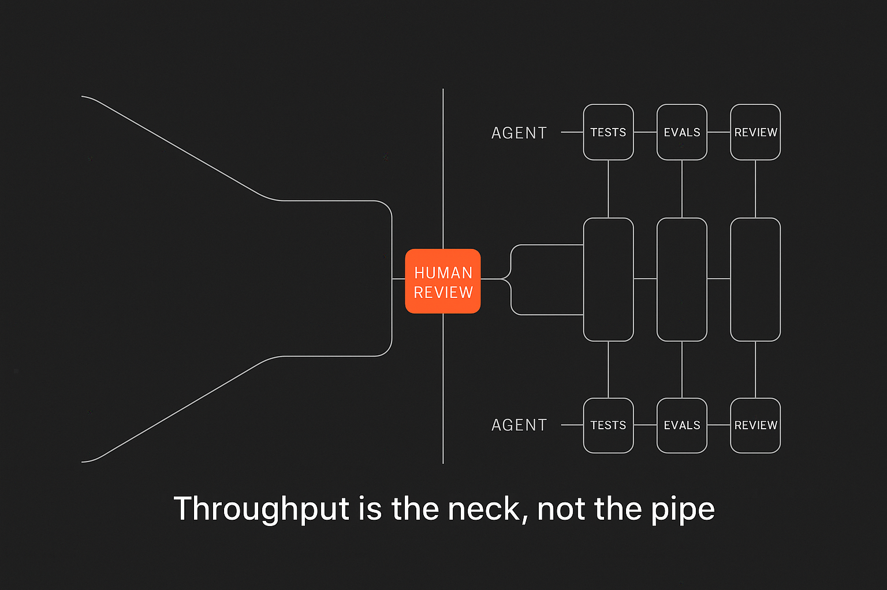

When tasks are clearly defined, AI agents can handle the code. Today, repo-aware agents already read codebases, update files, run tests, and submit pull requests. Your competitive advantage isn't typing faster—it's designing automated systems that reliably deliver without constant supervision.

Think of LLMs (Large Language Models) as intelligent but unpredictable teammates. To use them effectively, treat outputs as probabilistic rather than guaranteed. Your job shifts from performing repetitive tasks to engineering clarity and effective checkpoints.

## Clearly Defined Tasks Unlock Automation

Automation thrives on clearly defined tasks:

* Known inputs and expected outputs.
* Explicitly documented standards.
* Well-understood risks and constraints.

For most teams, a single human review bottleneck slows everything down. Replace this bottleneck with parallel checks:

* Automated tests
* Evaluation checkpoints
* Policy validations

Your role becomes "human-on-the-loop," stepping in only for critical tasks or conflicts.

## Building a Solo Cell for Maximum Output

A Solo Cell is the smallest autonomous unit for scaling software development—one human orchestrator and multiple automated agents:

* **Orchestrator (You):** Clearly defines problems, specs, constraints, risks, and vetoes.
* **Code Agents:** Make code-level changes across the repository.
* **Testing Agents:** Generate tests, run evaluations, and verify changes.
* **Review Agents:** Analyze code diffs for standards compliance, dependencies, and performance.
* **Release Agents:** Handle versioning, CI/CD gates, changelog updates, and safe deployments (canaries, rollbacks).

In short, you define the rules; agents handle execution.

### Minimal Permissions Limit Risk

Give each agent only the permissions necessary:

* **Code Agents:** File write permissions only.
* **Testing Agents:** Temporary test-run permissions.
* **Review Agents:** Read-only access.
* **Release Agents:** Permissions for deployment-related tasks only.

If additional privileges become necessary, explicitly grant them, avoiding accidental power creep.

## Context Engineering: Less Prompts, More Precision

Precise context is superior to lengthy prompts. Agents perform better when given concise, relevant information rather than overloaded prompts:

* Clearly structured repositories
* Explicit API schemas
* Defined dependency guidelines
* Performance and security rules

Keep instructions sharp and brief—like giving directions with clear street names rather than vague landmarks.

### Rules Must Be Machine-Readable

Transform human guidelines into machine-readable formats:

* Linters
* Configuration files
* Automated contract tests

Without clear rules, agents guess—and humans inevitably redo their work.

## Replacing Human Review with Automated Checks

One human reviewer means one bottleneck. Replace it with multiple, automated checkpoints:

### Define Explicit, Machine-Enforceable Standards

Clearly document standards around:

* Code style and formatting
* Dependencies and upgrades
* Performance thresholds
* Security best practices

Automate enforcement through CI pipelines and review agents that automatically annotate code diffs.

### Progressive Delegation Based on Risk

Delegate incrementally:

1. **Low risk:** Documentation and minor refactors—auto-merged after passing automated tests.
2. **Medium risk:** Well-defined feature changes—automated editing with human oversight for anomalies.
3. **High risk:** Architectural changes—agents present options and impacts; you make the final decision.

### Track Clear Metrics

Measure automation impact objectively:

* PR merge time by risk category
* Percentage of auto-merges without human intervention
* Incident rate per 100 merges
* Agent error/rework rate

If metrics stall, your standards or guidelines might need clarification.

## Security Boundaries Keep Automation Safe

Define explicit security practices:

* Assign least privileges per role and regularly rotate credentials.
* Block unexpected outbound network calls.
* Never expose sensitive data or credentials directly to agents.
* Enforce automated rollback mechanisms for failed deployments.

Mark clear boundaries—some tasks remain strictly manual for security reasons, particularly sensitive data interactions.

## Practical Approach to Legacy Systems

Automating legacy systems is possible with cautious, grey-box techniques:

* Use network, DOM, and database traces to build executable specifications.
* Decompile legacy code selectively, focusing only on critical paths.

Your goal isn't perfect understanding—it's sufficient confidence to automate effectively.

## 30-Day Plan for Implementing Automation

Follow a structured 30-day approach:

### Week 1: Standards and Baselines

* Clearly document standards and risks.
* Set up baseline tests and initial evaluation checkpoints.
* Integrate strict policy enforcement in CI.

### Week 2: Simple Automation

* Enable agents for trivial edits (formatting, documentation).
* Require consensus from multiple agent runs.
* Introduce review annotations.

### Week 3: Feature Development

* Use explicit specs; agents handle majority edits.
* Release agent begins managing deployments, tagging, and changelogs.

### Week 4: Increased Automation Trust

* Promote medium-risk auto-merging under strict criteria.
* Track performance metrics and adjust.
* Set up alerts for unexpected evaluation outcomes.

## Common Pitfalls to Avoid

Avoid these traps:

* A single human reviewer bottleneck.
* Too many agents without clear ownership.
* Vague instructions causing confusion.
* Treating probabilistic agent outputs as guarantees.
* Providing excessive privileges "just in case."
* Lengthy, unclear prompts instead of precise context.

## Quick FAQs to Understand Agentic Engineering

**What's different about agentic automation?**
Agentic systems handle probabilistic outputs from AI agents through sampling, validation, and automation gates rather than deterministic scripts.

**Do we still need code reviews?**
Rarely, yes—reserve human review for exceptions, critical changes, and escalated conflicts.

**What's context engineering exactly?**
Carefully curating precise instructions, code snippets, and guidelines rather than generic prompts.

**How do we know automation is successful?**
Track reduced merge times, increased auto-merge rates, low rollback incidents, and reduced manual rework.

**Can legacy systems use this approach?**
Yes—grey-box methods enable automating legacy code without complete refactoring.

## Next Steps: Your Edge is System Design, Not Typing Speed

Writing clear tickets is easy; automating clear tickets is revolutionary. Your competitive advantage now lies in clearly framing problems, encoding precise constraints, setting strong security boundaries, and shaping systems that automate safely and effectively.

Teams become leaner. Senior engineers multiply their impact. Decide if you'll automate yourself into leverage—or remain the bottleneck.
