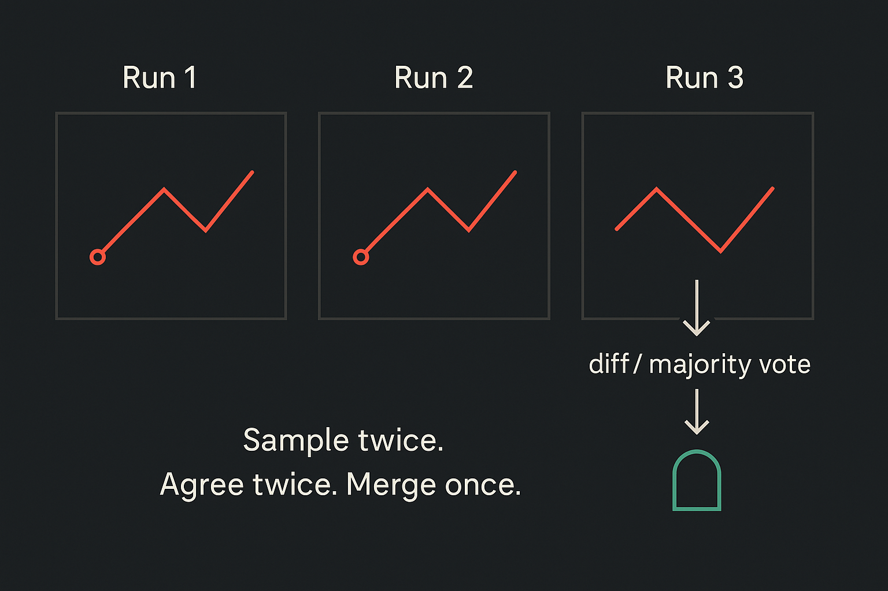

When clear work is well-specified, agents can ship it. Repo-aware agents that read the codebase, change files, run tests, and open PRs already push real code. Your edge is no longer typing or rubber‑stamping. Your edge is designing the machine that ships without you, and knowing when to step in.

Treat LLMs like non-deterministic instruments. Sample. Compare. Gate. Keep deterministic math and safety‑critical checks out of the loop. Build tolerance like you would for any noisy sensor. If agents thrive on clarity, your job is to engineer clarity at scale.

### What “Clear Work” Means Today

Clear work is bounded work: known inputs, expected outputs, and codified standards. With repo‑aware tools, an agent can change a function, regenerate tests, and submit a PR. The human bottleneck appears at a single review runway—that’s where throughput collapses.

Most teams have a wide pipe of tasks that narrows at “Human Review.” Replace that single lane with parallel lanes gated by tests, evals, and policy checks. Aim for human‑on‑the‑loop, not in the loop: you step in on high blast radius or when signals disagree.

---

## The Solo Cell Blueprint

A Solo Cell is the smallest unit that scales output with many agents and one owner. One owner means no queue. Many agents means parallelism with control.

- **Orchestrator (you):** frame problems, write specs, set constraints, tag risk, veto.
- **Code/Edit Agent(s):** file-level changes across the repo.
- **Test/Eval Agent(s):** generate and run tests and evals; multi‑pass by default.
- **Review Agent:** structured diff analysis, standards, dependencies, perf heuristics.
- **Release Agent:** versioning, changelog, CI gates, canary and rollback hooks.

### Orchestrator vs Conductor

The orchestrator defines the score (interfaces, constraints, risk tiers). The conductor sets tempo (flow, pauses, split points). In a Solo Cell, you wear both hats.

### Core Agent Roles and Minimal Permissions

Give each agent the least it needs. Code/Edit writes code. Test/Eval runs tests with ephemeral credentials. Review reads diffs and policies. Release touches tags and deploys. Separate tokens and scopes. If a role needs more power, add it deliberately, not by default.

---

## Agentic Engineering in Practice

Agentic engineering makes agents reliable in real software by connecting context engineering, eval design, interfaces, and risk routing. LLMs give probabilistic outputs; your system delivers dependable behavior.

### Context Engineering > Prompts

Tokens are real estate. Feed only what matters: exact files, APIs, schemas, decisions, and standards. Encode conventions agents enforce:

- file and folder layout
- dependency allowlists and upgrade windows
- performance budgets by service and endpoint
- error semantics and retry rules

Short, sharp context beats long, mushy prompts.

#### Conventions Agents Enforce

Put rules in machine‑readable forms: linters, config, rule tables, contract tests. If policy isn’t codified, agents guess—and humans rework.

### Evals and Test Harnesses

Trust math, not vibes. Build targeted evals:

- spec‑by‑example fixtures and golden files
- randomized invariants and properties
- diff expectations for known transforms/refactors

Run twice, diff twice, merge once. If two samples agree and gates are green, auto‑merge for low‑risk scopes.

### Architecture and Trade‑offs

Interfaces tame agents. Prefer simple data flows and stable contracts. Cleverness increases variance; variance increases rework.

### Managing Non‑Determinism

Route by blast radius. Sample with small prompt variations. Compare outputs. Alert on divergence. Tiers:

- **Low risk:** auto‑merge under strict checks.
- **Medium:** quick human glance on anomalies.
- **High:** deliberate review with deeper evals.

---

## Replace the Human Gate with a System

A universal human reviewer is a single‑lane runway. Replace it with explicit standards and gates.

### Machine‑Enforceable Standards

Codify: code style, dependency policy, performance budgets, security patterns, error semantics. Enforce via linters, CI jobs, and rule engines. Let the Review Agent annotate diffs against those rules. No rule, no expectation.

### Progressive Delegation Tiers

Start small. Promote with evidence.

1. **Scaffolding and formatting** — docs, formatting, small refactors behind snapshots; multi‑run agreement required.
2. **Well‑specified features behind tests** — agents edit broadly; humans design specs and arbitrate conflicts.
3. **Architecture proposals with impact analysis** — agents surface options and trade‑offs; you decide.

### Metrics That Matter

Track what changes behavior:

- median PR time‑to‑merge by risk tier
- share of merges without human intervention while quality holds
- incidents per 100 merges; mean time to rollback
- agent rework rate (how often humans undo agent changes)

If numbers stall, standards or context are unclear.

---

## Security and Data Boundaries

- least privilege by role; separate tokens for Code/Edit, Test/Eval, Review, Release
- domain allowlists for fetch; log and block unexpected outbound calls
- no agentic browsing with production credentials
- keep secrets out of LLM context; use sealed CI variables and one‑way runners
- canary first; auto‑rollback on error budgets; agents can trigger rollback but never silence alerts

### The “Do Not Automate” Zone

Private Data ∩ Untrusted Input ∩ Exfil Channels = high risk. Don’t automate without strict containment and human review.

---

## Grey‑Box Understanding of Legacy Systems

Spec before code. Capture DOM/network/DB traces. Draft an executable spec from those traces. Decompile only for critical paths. You want enough confidence to change the system, not perfect certainty.

---

## A 30‑Day Solo Cell Plan

- **Week 1 — Standards + Skeleton:** define risk tiers, codify policies, baseline tests, one eval per critical flow; fail CI hard on policy.
- **Week 2 — Agents in the Loop:** enable Code/Edit and Test/Eval on formatting/docs/trivial refactors; require multi‑run agreement; start Review Agent annotations.
- **Week 3 — Real Features Behind Guards:** use spec‑by‑example; agents do most edits; Release Agent handles tagging/changelog/canary.
- **Week 4 — Human‑on‑the‑Loop:** promote medium‑risk auto‑merges when all gates pass; track latency and rework; add eval drift alerts.

---

## Anti‑Patterns to Avoid

- universal reviewer
- agent zoo without ownership
- vibes in, thrash out
- treating RNG as truth
- “just in case” privileges
- long, fuzzy prompts instead of sharp context

---

## FAQs

**1) Agentic vs standard automation?**
Standard automation is deterministic. Agentic engineering accepts model variance and adds sampling, agreement, and gates to get dependable outcomes.

**2) Do I still need code reviews?**
Yes, by exception. Auto‑merge clean, low‑risk changes; keep a human veto for medium/high risk.

**3) What is context engineering?**
Curating exact code/docs/schemas/rules and encoding policy as machine‑readable constraints—not just writing prompts.

**4) Which metrics prove value?**
Faster PR cycle time; higher auto‑merge share without quality drop; low rollback rates; lower human rework.

**5) How to handle flaky tests?**
Quarantine flakies; gate merges on stable suites; track flake rate; have agents propose isolated repros and property‑based checks.

**6) What permissions per agent?**
Split by role; sandbox Test/Eval; rotate tokens; log every action.

**7) Can this work on legacy?**
Yes—use grey‑box methods (DOM capture, network tracing, DB diffing) to build an executable spec first.

**8) Where do LLMs shine?**
Reading/writing/refactoring under strict context; drafting tests/docs. Keep math and safety‑critical checks deterministic.

---

## Next Step

Clear tickets are a commodity. Your edge is the system: framing problems, encoding constraints, building evals, setting risk and security, and shaping interfaces agents extend without drama. Teams get smaller. Seniors own more leverage. Choose to conduct—or stay the bottleneck your agents wait for.

